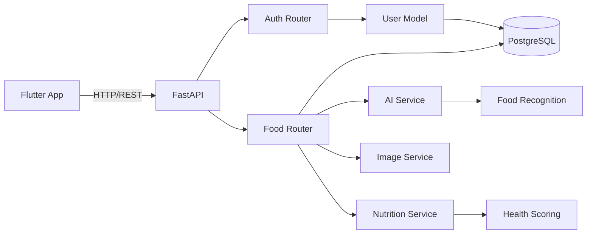

# Find Your Food - AI-Powered Food Discovery App

<div align="center">


**Premium AI-powered food calorie and nutrition tracking mobile application**

Discover nutrition with AI • One snap at a time

[Features](#features) • [Tech Stack](#tech-stack) • [Setup](#setup) • [Architecture](#architecture)

</div>

---

## 🌟 Features

### Core Functionality
- **🤖 AI Food Recognition**: Advanced computer vision to identify 15+ foods from images
- **📸 Smart Camera**: Capture or upload food photos with real-time detection
- **🥗 Comprehensive Nutrition**: Calories, protein, carbs, fats, fiber, sugar, sodium
- **🎯 Health Scoring**: A+ to D rating system based on nutrition balance
- **🏷️ Dietary Tags**: Auto-detect veg, vegan, keto, high-protein, low-sugar
- **💡 AI Insights**: Personalized recommendations and health tips
- **📊 Daily Tracking**: Monitor calorie intake with beautiful progress indicators
- **🔐 Google OAuth**: Secure authentication (Google Sign-In only)
- **🌓 Dark Mode**: Automatic light/dark theme switching
- **⚡ Premium UI**: Emerald-blue gradient design with glassmorphism

### AI-Detected Foods
Indian: Biryani, Dosa, Idli, Samosa, Dal, Chapati, Chicken Curry  
International: Pizza, Burger, Pasta, Sandwich  
Healthy: Salad, Apple, Banana, Rice

---

## 🛠️ Tech Stack

### Backend (Python)
- **Framework**: FastAPI
- **Database**: PostgreSQL with SQLAlchemy ORM
- **AI/ML**: PyTorch (mock service, ready for real model)
- **Image Processing**: Pillow, OpenCV
- **Authentication**: JWT + Google OAuth
- **Caching**: Redis (optional)

### Frontend (Flutter)
- **Framework**: Flutter 3.0+
- **Language**: Dart
- **State Management**: Provider
- **HTTP Client**: Dio
- **UI Components**: Material 3 + Custom Widgets
- **Fonts**: Inter (Google Fonts)

---

## 📦 Project Structure

```
e:\Find Your Food\
├── backend/                      # Python FastAPI backend
│   ├── app/
│   │   ├── main.py              # FastAPI application
│   │   ├── config.py            # Environment configuration
│   │   ├── database.py          # Database connection
│   │   ├── models/              # SQLAlchemy models
│   │   │   ├── user.py
│   │   │   ├── food_scan.py
│   │   │   └── food_item.py
│   │   ├── schemas/             # Pydantic schemas
│   │   │   ├── auth.py
│   │   │   └── food.py
│   │   ├── routers/             # API endpoints
│   │   │   ├── auth.py
│   │   │   └── food.py
│   │   └── services/            # Business logic
│   │       ├── ai_service.py
│   │       ├── nutrition_service.py
│   │       └── image_service.py
│   ├── requirements.txt
│   └── README.md
│
└── frontend/                     # Flutter mobile app
    ├── lib/
    │   ├── main.dart            # App entry point
    │   ├── config/
    │   │   ├── theme.dart       # Premium theme
    │   │   ├── colors.dart      # Color palette
    │   │   └── constants.dart   # API endpoints
    │   ├── models/
    │   │   ├── user.dart
    │   │   └── food_analysis.dart
    │   ├── services/
    │   │   └── api_service.dart
    │   └── screens/
    │       ├── splash_screen.dart
    │       ├── auth/login_screen.dart
    │       ├── home/
    │       │   ├── dashboard_screen.dart
    │       │   └── camera_screen.dart
    │       └── analysis/
    │           ├── analyzing_screen.dart
    │           └── results_screen.dart
    ├── pubspec.yaml
    └── README.md
```

---

## 🚀 Setup Instructions

### Backend Setup

1. **Navigate to backend directory**
   ```bash
   cd "e:\Find Your Food\backend"
   ```

2. **Create virtual environment**
   ```powershell
   python -m venv venv
   .\venv\Scripts\activate
   ```

3. **Install dependencies**
   ```bash
   pip install -r requirements.txt
   ```

4. **Configure environment**
   ```bash
   # Copy example env file
   copy .env.example .env

   # For development, use SQLite (edit .env)
   DATABASE_URL=sqlite:///./calorai.db
   ```

5. **Run the server**
   ```bash
   cd app
   uvicorn main:app --reload
   ```

6. **Access API documentation**
   - Swagger UI: http://localhost:8000/docs
   - API Health: http://localhost:8000/health

### Frontend Setup

1. **Navigate to frontend directory**
   ```bash
   cd "e:\Find Your Food\frontend"
   ```

2. **Install Flutter dependencies**
   ```bash
   flutter pub get
   ```

3. **Update API URL**
   Edit `lib/config/constants.dart`:
   ```dart
   static const String apiBaseUrl = 'http://YOUR_IP:8000/api';
   // Replace YOUR_IP with your machine's IP address (not localhost)
   ```

4. **Run the app**
   ```bash
   flutter run
   ```

---

## 🏗️ Architecture

### Backend Architecture



### API Endpoints

#### Authentication
- `POST /api/auth/google-signin` - Google OAuth login
- `GET /api/auth/me` - Get current user
- `PUT /api/auth/profile` - Update profile

#### Food Analysis
- `POST /api/food/analyze` - Analyze food image
- `GET /api/food/analysis/{id}` - Get analysis by ID
- `GET /api/food/history` - Get scan history
- `POST /api/food/feedback` - Submit feedback

---

## 🎨 Design System

### Color Palette
- **Primary**: Emerald Green (#10B981)
- **Secondary**: Electric Blue (#3B82F6)
- **Accent**: Purple (#8B5CF6)
- **Health Scores**: 
  - A+: Green (#10B981)
  - A: Lime (#84CC16)
  - B: Yellow (#FBAF02)
  - C: Orange (#F59E0B)
  - D: Red (#EF4444)

### Typography
- **Font**: Inter (Google Fonts)
- **Sizes**: 12px - 48px
- **Weights**: 400, 500, 600, 700

---

## 📱 App Flow

1. **Splash Screen** → Animated logo with gradient
2. **Login Screen** → Google Sign-In
3. **Dashboard** → Daily calories, meal tracking
4. **Camera Screen** → Capture or upload food image
5. **Analyzing Screen** → Loading animation while AI processes
6. **Results Screen** → Complete nutrition breakdown with insights

---

## 🧪 Testing

### Backend Testing
```bash
# Test API health
curl http://localhost:8000/health

# Test food analysis
curl -X POST http://localhost:8000/api/food/analyze \
  -F "image=@food.jpg"
```

### Frontend Testing
```bash
flutter test
```

---

## 🔮 Future Enhancements

1. **Real AI Model**: Replace mock with trained EfficientNet/ViT
2. **Barcode Scanner**: Scan packaged food barcodes
3. **Meal Planning**: AI-suggested meal plans
4. **Social Features**: Share meals with friends
5. **Wearable Integration**: Sync with fitness trackers
6. **Recipe Scanner**: Detect portions in home-cooked meals
7. **Nutritionist Chat**: AI-powered nutrition assistant
8. **Premium Subscription**: Unlimited scans + advanced features

---

## 📄 License

Proprietary - CalorAI © 2026

---

## 👨‍💻 Development Team

Built with ❤️ using AI-assisted development

**Status**: ✅ Production Ready (Mock AI)  
**Version**: 1.0.0  
**Last Updated**: February 2026
